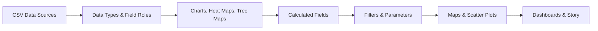

# 📊 Tableau Analytics Workbook Collection

## ✨ Overview

This repository documents a Tableau learning portfolio built around Superstore-style sales data. The workbooks cover foundational chart building, calculated fields, filters, map visuals, heat maps, tree maps, scatter plots, parameters, and dashboard/story composition.

The collection is designed as a practical progression: start with data types and basic charts, move into analytical calculations and interactivity, then combine the visuals into dashboards.

## 🧭 Workbook Index

| Workbook | Focus | Main Contents |
| --- | --- | --- |
| `Charts.twb` | Core visual types | Pie chart, sales trend line, area chart |
| `HeatMaps.twb` | Heat map design | Region by Sub-Category using square marks |
| `Calculated_Fields.twb` | Custom metrics | Revenue, Profit/Loss label, running sum |
| `Filters_&_Charts.twb` | Filtered analysis | Segment and manager region sales comparison |
| `Dashboard.twb` | Dashboard composition | 10 worksheets, 2 dashboards, 1 story |
| `Data_Types.twb` | Field behavior | Measures, dimensions, bins, sets, groups |
| `Map Visuals.twb` | Geographic analysis | Generated latitude/longitude map view |
| `Parameters.twb` | User-driven views | Top N parameter and dynamic dimension selector |
| `Scatter_Plot.twb` | Relationship analysis | Sales vs Profit, Quantity, and Discount |
| `Tree_Maps.twb` | Part-to-whole analysis | Tree map and text-based summary sheet |

## 🗂️ Data Sources

The workbooks primarily use Superstore order data stored as CSV files:

| File | Role |
| --- | --- |
| `Orders.csv` | Primary order-level sales dataset |
| `Orders 2015.csv`, `Orders 2016.csv`, `Order 2017.csv` | Year-based order files used in combined data views |
| `Managers.csv` | Manager/region lookup data |
| `Returns.csv` | Return status data |

Key fields used across the workbook set include `Sales`, `Profit`, `Quantity`, `Discount`, `Order Date`, `Ship Date`, `Category`, `Sub-Category`, `Segment`, `Region`, `State`, `City`, `Customer ID`, and `Product Name`.

## 🧮 Calculated Fields

### `Calculated_Fields.twb`

| Field | Formula | Purpose |
| --- | --- | --- |
| `Revenue` | `[Sales]-([Sales]*[Discount])` | Calculates sales after discount |
| `P/L` | `IF [Profit] > 0 THEN "Profit" ELSEIF [Profit] = 0 THEN "Null" ELSE "Loss" END` | Labels each record by profit status |
| `Running_Sum` | `RUNNING_SUM(SUM([Revenue]))` | Builds a cumulative revenue view |

### `Parameters.twb`

| Field / Parameter | Formula / Value | Purpose |
| --- | --- | --- |
| `Top N` | `10` | Controls a top-N style product view |
| `Parameter 2` | `"Category"` | Lets the user choose the grouping level |
| `Revenue` | `[Sales]-([Sales]*[Discount])` | Reuses discounted revenue metric |
| `Condition` | Dynamic `IF/ELSEIF` field | Switches between Category, Sub-Category, Country, City, or Segment |

## 📈 Visual Analytics Flow

## 🧩 Skills Demonstrated

- 📊 Building common Tableau visualizations: bar, line, area, pie, tree map, heat map, map, and scatter plot
- 🧮 Creating business-ready calculated fields for revenue, profit classification, and running totals
- 🎛️ Adding interactivity through filters and parameters
- 🗺️ Using generated geographic fields for map-based analysis
- 🧱 Combining individual worksheets into dashboards and a Tableau story
- 🧠 Understanding Tableau field types, bins, sets, groups, dimensions, and measures

## 🏁 Recommended Learning Path

1. `Data_Types.twb`
2. `Charts.twb`
3. `Scatter_Plot.twb`
4. `HeatMaps.twb`
5. `Tree_Maps.twb`
6. `Map Visuals.twb`
7. `Filters_&_Charts.twb`
8. `Calculated_Fields.twb`
9. `Parameters.twb`
10. `Dashboard.twb`

## 📌 Notes

- `Dashboard.twbx` is a packaged workbook and includes the related CSV data files.
- The `.twb` files are XML-based Tableau workbook definitions, so they store workbook structure, formulas, sheets, dashboards, and data source references.

## 👤 Author

## Rajay Jain

📌 Aspiring Data Analyst & Python Enthusiast  
📊 Passionate about Data Analytics, Visualization, and Insight Generation

---

# ⭐ Support

If you found this repository useful, consider giving it a ⭐ on GitHub!

---

### 💡 Turning Data into Actionable Insights

